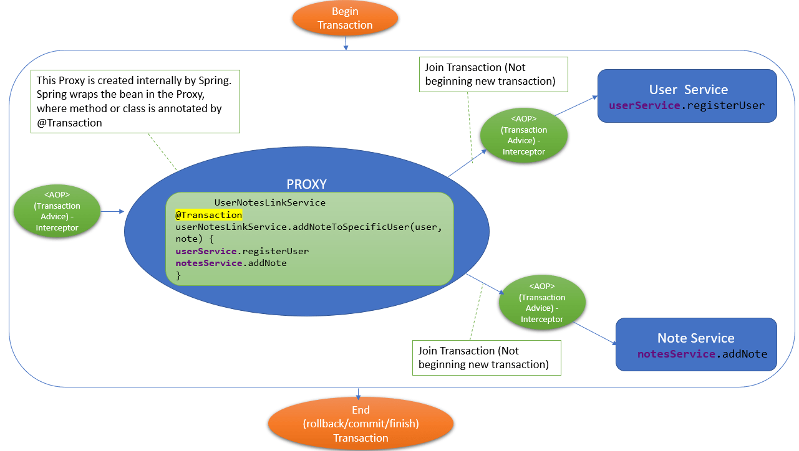

1. Có 2 loại Spring transaction
  -  Loại 1 : Khai báo tường minh :
 
    Transaction trans = entityManger.getTransaction();
    try {
        trans.begin();
        
        businessLogic();

        trans.commit();

      } catch(Exception e) {
         
        trans.rollback();
        throw exception;

    }
    
  - Loại 2 : Sử dụng annotation @Transactional:

      
      @Transactional
      public void saveData(){

      }
  
        
2. Cơ chế hoạt động của transaction trong spring ?
    
    - Về cơ bản, Transaction management trong spring boot được implement bởi AOP

    - Spring tự tạo một proxy cho class hoặc method được đánh dấu annotation @Transactional
   
    - Khi một method được gọi, proxy sẽ gọi Transaction Intercepter, Sau đó method tiếp tục xử lí business  logic.
    
    - Sau khi xử lí logic xong. TransactionIntercepter sẽ commit (hoặc rollback nếu lỗi)
    
    

3. Chú ý:

   - Mặc định @Transactional sẽ rollback chỉ đối với CheckedException và Error (ko rollback cho UncheckedException)

   - Vì vậy có thể định nghĩa "rollbackFor" để muốn rollback cho loại exception nào

4. Các loại Transaction Propagation

   - Có 6 loại propagation, REQUIRED là giá trị mặc định của Transaction Propagation